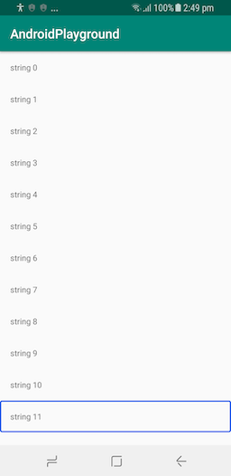
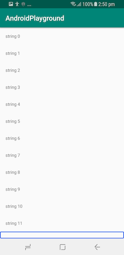
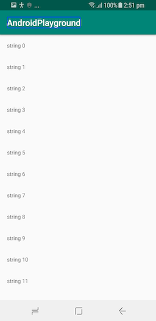
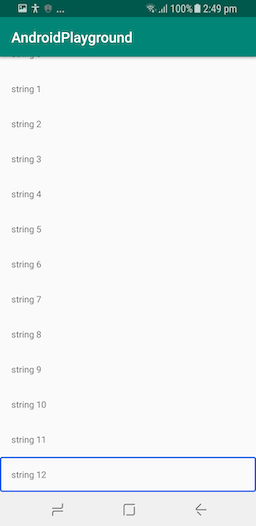
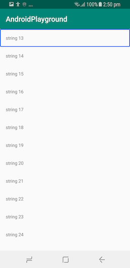

# Android-Playground

The purpose of this repo is the demostrate Android Accessibility issue that been found in Samsung devices.

The problem is lays on the following pre-requisit:
* User is using a Samsung device
* Talk Back is turned ON, 
* User is using Linear Navigation Gestures (swipe left & right to navigate between elementds on screen)
* User is navigating inside a recycler view

Items that are outside of the current viewpoert (screen) cannot gain focus (by Talk Back) when user tries to navigate to the next item from the last visible item in recycler view. 

Please refer to the following screenshots steps:

What happens in Samsung device:

  

Expected (what happens in other devices):

  

