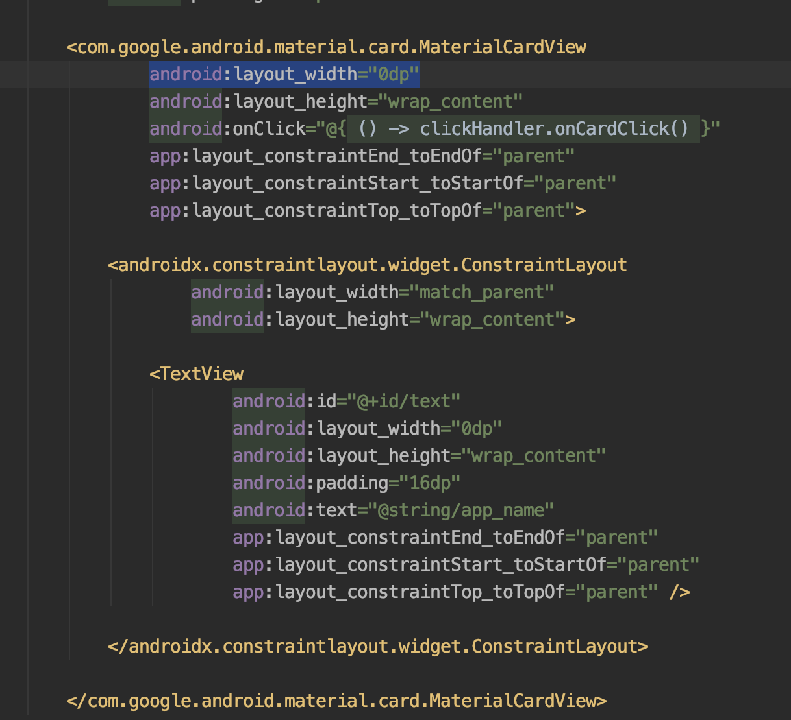

# Android API 23, MDC card view inside ConstraintLayout been measured incorrectly

| Actual Result | Expected Result |
| -- | -- |
|  |  |
|  |  |

If we see the above implementation, set the width to `match_parent` is not recommended but it will fix the issue.
While if we set the width to `0dp`, ConstraintLayout will mess up the measurements

### NOTE
This issue ONLY happens in API 23